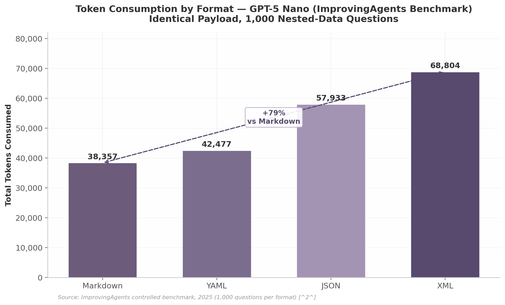
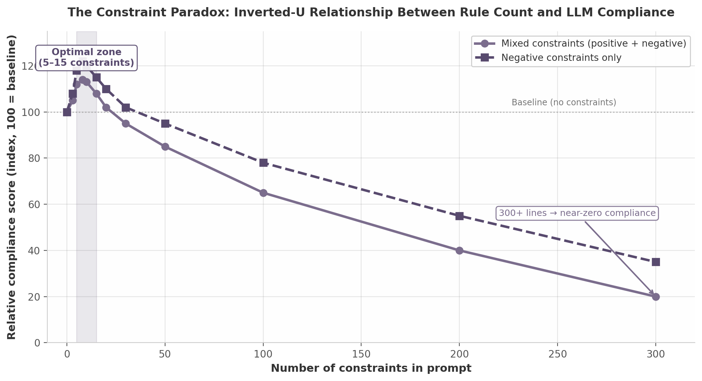
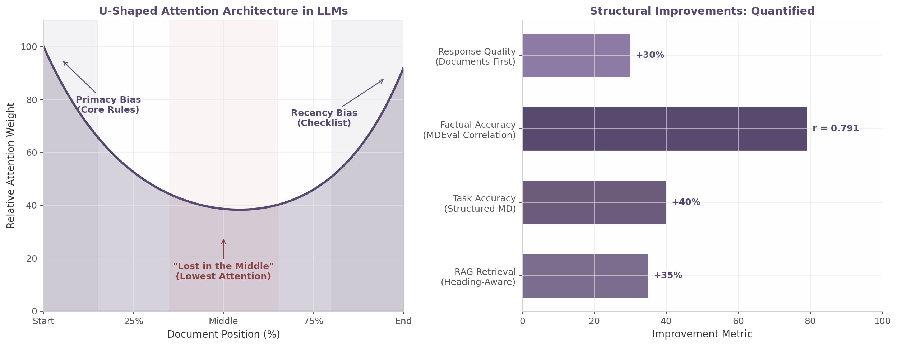
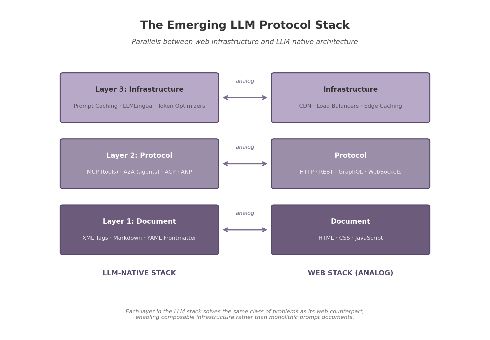
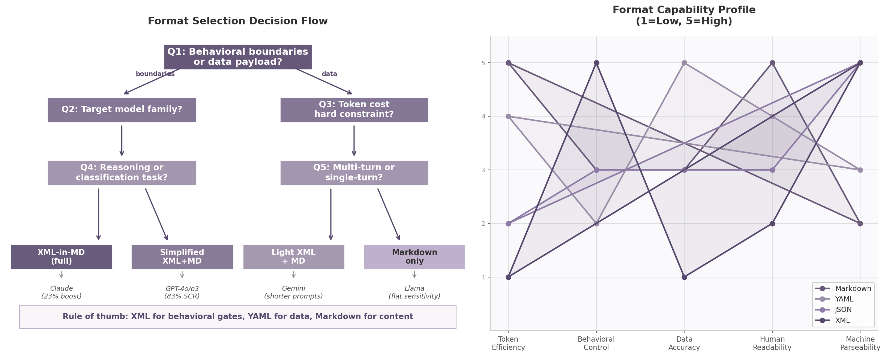

# LLM Document Schemas: A Practitioner's Guide to XML-in-Markdown, Format Optimization, and Execution Contracts

**A comprehensive analysis of which data schemas LLMs understand best, with critical analysis of the XML-in-Markdown execution contract pattern.**

*Generated: June 2026 | Based on 12 research dimensions, 200+ sources, controlled benchmarks across 3+ model families*

---

## 1. Executive Summary

### 1.1 The Core Finding

No single data format dominates every LLM use case. The evidence from over 1,000 controlled tests across three model families establishes that the optimal LLM document is *polyglot by design*: XML for behavioral boundaries, YAML for metadata and data payloads, and Markdown for content and human readability  [(Improving Agents)](https://www.improvingagents.com/blog/best-nested-data-format/)   [(anthropic.com)](https://docs.anthropic.com/en/docs/build-with-claude/prompt-engineering/use-xml-tags#example-legal-contract-analysis) . This runs counter to the intuition that picking "the best format" is sufficient. Each format excels in a specific functional domain and fails in others; the engineering task is to match format to function.

The central dichotomy is XML's dual nature. XML tags excel as behavioral control mechanisms — Anthropic fine-tuned Claude to attend to XML delimiters during training  [(vellum.ai)](https://www.vellum.ai/blog/prompt-engineering-tips-for-claude) , and peer-reviewed research confirms XML semantic layering improves reasoning accuracy by up to 23%  [(arXiv.org)](https://arxiv.org/html/2605.03353v2) . Yet the same XML performs worst for data encoding: YAML achieved 62.1% comprehension accuracy versus XML's 44.4% on identical payloads — a 17.7 percentage point gap  [(Improving Agents)](https://www.improvingagents.com/blog/best-nested-data-format/) . XML ranks first for behavioral control and last for data accuracy; format selection must be task-aware.

The anchor cost figure is 80% token overhead. XML consumed 68,804 tokens versus Markdown's 38,357 for the identical payload — a 79.4% premium compounding directly into API bills and shorter context windows  [(Improving Agents)](https://www.improvingagents.com/blog/best-nested-data-format/) . At 1,000 API calls per day, choosing XML over YAML for data payloads wastes approximately 26 million tokens monthly  [(AgenticSkillset.org)](https://agenticskillset.org/en/topics/structured-context-formats/) .

### 1.2 The Five Rules in Brief

**Rule 1: Use XML tags for behavioral boundaries, never for data payloads.** XML's paired delimiters create hard semantic boundaries that survive tokenization  [(Source)](https://rahulkashyap.dev/blog/system-prompt-harness) , making them ideal for instruction separation and constraint gating. Using XML for tabular data incurs the 80% token penalty while delivering the worst comprehension accuracy of any tested format  [(Improving Agents)](https://www.improvingagents.com/blog/best-nested-data-format/) .

**Rule 2: Negative constraints outperform positive directives by 7–14 percentage points.** Research on 25,532 coding-agent rules found that negative constraints ("do not X") were the only consistently beneficial type, while positive directives ("do X") were frequently harmful — their removal improved performance  [(Emergent Mind)](https://www.emergentmind.com/papers/2604.11088)   [(arXiv.org)](https://arxiv.org/html/2604.11088v2) . Negative constraints encode discrete, enumerable prohibitions that converge to a stable boundary; positive directives encode continuous values that diverge into conflict  [(arXiv.org)](https://arxiv.org/html/2603.16417v1) .

**Rule 3: Adapt format encoding per model family — never copy identical schemas across models.** Claude receives XML-heavy documents with deep nesting; GPT-4o requires ~50% fewer tags with Markdown headings filling the gap; Gemini needs shorter prompts with XML reserved for task separation only; Llama performs best with Markdown-only structure  [(Github)](https://github.com/shakecodeslikecray/promptc) . The promptc project documented accuracy swings of up to 78.3 percentage points by format alone  [(Github)](https://github.com/shakecodeslikecray/promptc) .

**Rule 4: Position core constraints first, context second, task last.** LLM attention follows a U-shaped curve — primacy bias weights beginning content highest, recency bias weights end content second-highest, and the middle receives the least  [(Claude Code for Product Managers)](https://ccforpms.com/fundamentals/project-memory)   [(ClaudeLog)](https://www.claudelog.com/mechanics/claude-md-supremacy/) . Placing behavioral rules at the beginning maximizes adherence; placing verification checklists at the end leverages recency for self-evaluation  [(arXiv.org)](https://arxiv.org/html/2401.01313v1) .

**Rule 5: 5–10 well-crafted constraints beat 300+ lines of exhaustive rules.** The inverted-U compliance curve shows a small set of sharp negative constraints produces measurable improvement, but exhaustive lists trigger attention dilution and near-zero compliance  [(Github)](https://github.com/NousResearch/hermes-agent/issues/29652) . The practical ceiling is 15 total constraints; constraint *design* matters more than *encoding*  [(Agent Patterns)](https://agentpatterns.ai/instructions/) .

### 1.3 What This Report Delivers

This report provides three categories of actionable output. First, hard benchmark data from the ImprovingAgents controlled test (1,000 questions per format across three models)  [(Improving Agents)](https://www.improvingagents.com/blog/best-nested-data-format/) , supplemented by tokenization mechanics analysis and the accuracy-paradox research showing format constraints can degrade reasoning performance by 15.5 percentage points on the wrong task type  [(ACL Anthology)](https://aclanthology.org/2024.emnlp-industry.91.pdf) . Second, a critical analysis of a production four-gate execution contract schema, identifying eight structural gaps and providing an enhanced version with YAML frontmatter, priority-tiered constraints, and confidence-scored verification  [(arXiv.org)](https://arxiv.org/html/2602.22302v1) . Third, model-specific format recommendations with copy-paste-ready templates for Claude (XML-first), GPT-4o/o3 (simplified hybrid), Gemini (light XML), and Llama (Markdown-only), alongside a protocol-stack analysis of MCP and A2A integration  [(arXiv.org)](https://arxiv.org/html/2507.10644)   [(arXiv.org)](https://arxiv.org/pdf/2603.08852) . The chapters that follow build this evidence layer by layer, from controlled benchmarks through constraint theory to production deployment templates.


---

## 2. The Format Landscape: Hard Data and Controlled Benchmarks

Choosing a data format for LLM interaction has measurable consequences for both cost and accuracy. Controlled benchmarks completed in 2025 provide the first large-scale, cross-model evidence for how XML, JSON, YAML, and Markdown compare as data-encoding formats. This chapter presents those results, explains the tokenization mechanics behind the cost differentials, documents the accuracy paradox that makes strict formatting a liability for reasoning tasks, and synthesizes rankings across four distinct use-case dimensions.

### 2.1 The ImprovingAgents Controlled Benchmark

The most comprehensive controlled test to date was conducted by ImprovingAgents in early 2025, pitting four formats against one another on 1,000 stress-test-calibrated questions per format across three models  [(Improving Agents)](https://www.improvingagents.com/blog/best-nested-data-format/) . Each model received identical nested data structures encoded in each format, then answered comprehension questions requiring extraction, relation, and reasoning over multiple fields. The results for GPT-5 Nano establish a clear hierarchy:

| Format | Accuracy | 95% CI | Tokens | Overhead vs Markdown |
|--------|----------|--------|--------|---------------------|
| YAML | 62.1% | [59.1%, 65.1%] | 42,477 | +10.7% |
| Markdown | 54.3% | [51.2%, 57.4%] | 38,357 | Baseline |
| JSON | 50.3% | [47.2%, 53.4%] | 57,933 | +51.0% |
| XML | 44.4% | [41.3%, 47.5%] | 68,804 | +79.4% |

The accuracy gap between YAML and XML is 17.7 percentage points  [(Improving Agents)](https://www.improvingagents.com/blog/best-nested-data-format/) —a substantial delta for a supposedly cosmetic choice. More striking is the token cost differential: XML consumed 68,804 tokens versus Markdown's 38,357 for the *identical* payload, representing nearly an 80% overhead. Even JSON, often assumed to be compact, required 51% more tokens than Markdown and 36% more than YAML  [(Improving Agents)](https://www.improvingagents.com/blog/best-nested-data-format/) .



The bar chart above visualizes the token disparity. The 79% XML-to-Markdown gap is not merely a marginal cost increase—it translates directly into higher API bills and shorter effective context windows. At 1,000 API calls per day, the difference between XML and YAML alone compounds to approximately 26.3 million extra tokens monthly, enough to consume a significant portion of a commercial API quota  [(AgenticSkillset.org)](https://agenticskillset.org/en/topics/structured-context-formats/) .

**Cross-model consistency.** Gemini 2.5 Flash Lite replicated the ranking: YAML led at 51.9%, followed by Markdown (48.2%), JSON (43.1%), and XML (33.8%)  [(Improving Agents)](https://www.improvingagents.com/blog/best-nested-data-format/) . XML consumed 261,184 tokens versus 137,708 for Markdown on Gemini. The consistency across both models suggests the format-performance relationship is tied to structural properties of the formats rather than model-specific quirks. Llama 3.2 3B Instruct was the exception, showing little format sensitivity (48–52.7%), indicating smaller models lack the capacity to exploit format-specific cues  [(Improving Agents)](https://www.improvingagents.com/blog/best-nested-data-format/) .

### 2.2 The BPE Mechanism: Why XML Is Token-Inefficient

The token cost differentials are not arbitrary; they follow directly from how Byte Pair Encoding (BPE) tokenizers—the standard in virtually all modern LLMs—process structured markup  [(Github)](https://github.com/ScotterMonk/AgentFlow)   [(arXiv.org)](https://arxiv.org/html/2503.12511v3) .

**How BPE tokenizes markup.** BPE tokenizers split text into subword units based on co-occurrence frequencies from training data. Common English words often compress into single tokens ("the" → one token), but markup syntax fragments into multiple subcomponents because angle-bracket sequences are relatively rare in the tokenizer's training corpus  [(VMware)](https://www.vmware.com/docs/domain-specific-adaptation-of-pretrained-llms) . An opening tag like `<document>` splits into separate tokens: the `<`, the tag name, and the `>`, consuming three or more tokens where a natural-language word might consume one  [(VMware)](https://www.vmware.com/docs/domain-specific-adaptation-of-pretrained-llms) . Closing tags repeat the same fragmentation. As VMware's research notes, "HTML's syntax creates unnatural breaks in this process—a paragraph tag `<p>` splits into separate tokens, consuming valuable context window space without adding semantic value"  [(VMware)](https://www.vmware.com/docs/domain-specific-adaptation-of-pretrained-llms) .

The per-field overhead varies systematically across formats  [(AgenticSkillset.org)](https://agenticskillset.org/en/topics/structured-context-formats/) :

| Format Syntax | Tag Characters | Tokens per Field |
|---------------|---------------|------------------|
| `instruction:` (YAML/plain) | 13 | 2–3 |
| `## Instruction\n` (Markdown H2) | 17 | 3–4 |
| `{"instruction": "..."}` (JSON) | 18 | 5–6 |
| `<instruction>...</instruction>` (XML) | 29 | 7–9 |

XML tags cost 2–4x more tokens per field than YAML or plain labels. The compound effect is severe: for a structure containing 100 elements, XML opening and closing tags consume approximately 600 tokens in pure structural overhead, compared to roughly 50 tokens for YAML (where indentation is whitespace, tokenized cheaply) and 30 tokens for Markdown  [(MightyBot)](https://mightybot.ai/blog/best-structured-prompt-formats-for-llms/)   [(AgenticSkillset.org)](https://agenticskillset.org/en/topics/structured-context-formats/) .

**Tokenizer variation across model families.** The same text produces different token counts depending on the tokenizer architecture. GPT-4o uses o200k_base BPE; Claude uses a proprietary BPE variant; Llama 3 uses SentencePiece; Gemini uses a SentencePiece derivative  [(sinc-LLM | sincllm.com)](https://sincllm.com/token-counter)   [(Pocket Animus)](https://pocketanimus.com/guides/tokens-words-what-ai-counts/) . For structured data and markup, cross-model differences reach 20–40%  [(Pocket Animus)](https://pocketanimus.com/guides/tokens-words-what-ai-counts/) . The SACTOR framework found Claude 3.5 consumed 4,595 tokens for a code representation where GPT-4o consumed 2,651—a 73% difference on identical content  [(arXiv.org)](https://arxiv.org/html/2503.12511v3) . Format efficiency rankings derived on one tokenizer may shift on another, reinforcing the need for provider-specific benchmarking.

### 2.3 The Accuracy Paradox: Format Constraints Harm Reasoning

While the ImprovingAgents benchmark tests format-as-data-encoding, a complementary line of research investigates how format constraints affect the model's *reasoning process itself*. The findings reveal a paradox: stricter formatting can improve classification accuracy while degrading reasoning performance—a distinction with direct engineering implications.

The "Let Me Speak Freely" study by Tam et al. (2024) compared LLM performance across format restrictions on the GSM8K mathematics reasoning benchmark  [(arXiv.org)](https://arxiv.org/html/2408.02442v1)   [(ACL Anthology)](https://aclanthology.org/2024.emnlp-industry.91.pdf) . Natural-language prompting achieved 75.99% accuracy with GPT-3.5-Turbo. Adding XML constraints dropped accuracy to 60.45%—a 15.5-point decline  [(ACL Anthology)](https://aclanthology.org/2024.emnlp-industry.91.pdf) . YAML performed better than XML under constraint (71.58%), but still below the natural-language baseline. JSON fell to 74.70%, a smaller but still measurable degradation.

Schema constraints compounded the damage. When the authors added JSON Schema validation to the prompt, Claude-3-Haiku's GSM8K accuracy collapsed from 86.99% to 2.44%  [(ACL Anthology)](https://aclanthology.org/2024.emnlp-industry.91.pdf) . JSON with schema dropped to 49.25% on GPT-3.5-Turbo, and XML with schema fell to 45.06%. The paper's central conclusion is critical for practitioners: "the performance gap between text and structured formats are not primarily due to parsing errors, but rather to the impact of format restrictions on the LLM's reasoning and generation processes"  [(arXiv.org)](https://arxiv.org/html/2408.02442v3#S7) .

The effect is task-dependent. For classification tasks such as DDXPlus, JSON-mode *improved* performance by constraining the answer space to valid options  [(ACL Anthology)](https://aclanthology.org/2024.emnlp-industry.91.pdf) . But for reasoning tasks, "JSON-mode failed to adhere to the order of reasoning first followed by answer, causing a large drop in final performance"  [(Source)](https://rahulkashyap.dev/blog/system-prompt-harness) . The model conflates the structural requirement (produce valid JSON) with the reasoning requirement (think step-by-step before answering), effectively short-circuiting its own chain-of-thought.

The engineering implication is clear: for any task requiring multi-step reasoning, the model should be allowed to reason in natural language first, with format extraction performed as a separate post-processing step. This two-stage pattern—reason freely, then format—preserves the accuracy benefits of unconstrained reasoning while still delivering structured output for downstream consumption. The constraint should be applied to the *output* stage, not the *reasoning* stage  [(ACL Anthology)](https://aclanthology.org/2024.emnlp-industry.91.pdf)   [(arXiv.org)](https://arxiv.org/html/2408.02442v3#S7) .

### 2.4 Format Rankings by Use Case

No single format dominates every dimension. The optimal choice depends on whether the priority is data encoding density, behavioral control precision, token economy, or comprehension accuracy. The following rankings synthesize evidence from the ImprovingAgents benchmark  [(Improving Agents)](https://www.improvingagents.com/blog/best-nested-data-format/) , the MightyBot format analysis  [(MightyBot)](https://mightybot.ai/blog/best-structured-prompt-formats-for-llms/) , the JTON tokenization study  [(arXiv.org)](https://arxiv.org/html/2604.05865) , and the WYZER multi-agent benchmark  [(Wyzer)](https://wyzer.it/blog/Data-Format-Selection-for-Multi-Agent-LLM-Systems-An-Empirical-Analysis-of-Token-Efficiency) .

| Use Case | Rank 1 | Rank 2 | Rank 3 | Rank 4 | Rank 5 |
|----------|--------|--------|--------|--------|--------|
| **Data encoding (tabular)** | CSV/TSV | TOON | YAML | Compact JSON | XML |
| **Behavioral control** | XML tags | Markdown headings | YAML | JSON | Plain text |
| **Token efficiency** | Markdown | YAML | Compact JSON | Pretty JSON | XML |
| **Comprehension accuracy** | YAML | Markdown | JSON | XML | — |

These rankings reveal a fundamental tension: XML simultaneously ranks first for behavioral control (instruction separation, prompt organization, injection defense) and last for data encoding, token efficiency, and comprehension accuracy  [(MightyBot)](https://mightybot.ai/blog/best-structured-prompt-formats-for-llms/)   [(Improving Agents)](https://www.improvingagents.com/blog/best-nested-data-format/) . This is not a contradiction—it reflects the distinction between XML-as-boundary-marker (where explicit open/close tags provide unambiguous structural delimiters) and XML-as-data-format (where the same tag repetition incurs punishing token overhead). Anthropic's documentation captures this precisely: XML tags are recommended for "separating instructions, context, examples, documents, tool results, and output rules" but are "not usually the most token-efficient way to encode large tabular datasets"  [(MightyBot)](https://mightybot.ai/blog/best-structured-prompt-formats-for-llms/) .

The practical implication is that optimal LLM documents are *polyglot* by design. Production systems increasingly use YAML frontmatter for metadata, XML body tags for behavioral constraints, and Markdown or compact tabular formats for the data payload itself  [(Improving Agents)](https://www.improvingagents.com/blog/best-nested-data-format/)   [(MightyBot)](https://mightybot.ai/blog/best-structured-prompt-formats-for-llms/) . This hybrid approach—examined in Chapter 7—places each format where its strengths are maximized and its weaknesses are minimized. The rankings should be read as a decision matrix: identify which dimension matters most for a given component, then select the format that leads that column. For XML-in-Markdown specifically (the pattern explored in Chapter 3), these benchmarks explain *why* it works: XML sits in the behavioral-control role where it excels, while avoiding data-encoding duties where it fails. The 80% token penalty applies only when XML wraps data; when XML wraps *instructions*, the overhead is bounded by the small instruction set size, and the structural clarity benefit outweighs the cost.


---

## 3. XML-in-Markdown: The Complete Pattern Reference

### 3.1 What XML-in-Markdown Is and Is Not

XML-in-Markdown is the practice of embedding XML semantic tags within a Markdown document structure to control LLM behavior. It is not a data encoding scheme, nor is it a replacement for Markdown's navigational role. The pattern exploits a specific architectural property of Claude-family models: they were explicitly fine-tuned during training to treat XML tags as structural delimiters with behavioral significance  [(vellum.ai)](https://www.vellum.ai/blog/prompt-engineering-tips-for-claude) . This is not a stylistic convention — it reflects how Claude's tokenizer and attention mechanisms process paired opening and closing tags as hard semantic boundaries rather than decorative markup  [(arXiv.org)](https://arxiv.org/html/2605.08477v1) .

The compiler metaphor clarifies the distinction. In traditional compilation, source code contains both *data declarations* (what the program knows) and *control structures* (what the program does). XML tags in this pattern function exclusively as the latter — they are logic gates, not data containers. The tag `<absolute_constraints>` does not *contain* constraints in the sense of a database field holding a record; it *activates* a behavioral mode in the model, instructing the attention mechanism to weight everything inside that boundary as prohibition logic. Anthropic's own documentation frames this separation as central to prompt clarity: XML tags "help Claude parse your prompts more accurately, leading to higher-quality outputs" by creating unambiguous boundaries that survive tokenization  [(anthropic.com)](https://docs.anthropic.com/en/docs/build-with-claude/prompt-engineering/use-xml-tags#example-legal-contract-analysis) .

This behavioral boundary function is fundamentally different from XML-as-data-format. When XML encodes data (e.g., a configuration file or API payload), its purpose is information serialization — preserving structure and values for downstream parsing. When XML wraps a prompt instruction block, its purpose is attention routing — telling the model *how* to process the enclosed text. The distinction matters because XML performs worst among all tested formats for pure data accuracy (44.4% on structured data benchmarks versus YAML's 62.1%)  [(Improving Agents)](https://www.improvingagents.com/blog/best-nested-data-format/) , yet outperforms every alternative for behavioral control tasks  [(arXiv.org)](https://arxiv.org/html/2605.03353v2) .

Markdown cannot provide equivalent behavioral precision because its structural elements serve different purposes. Headings (`#`, `##`) are navigational anchors — they create an outline that helps both humans and models scan document hierarchy, but they do not enclose content in paired delimiters that can be parsed as executable boundaries. A Markdown heading introduces a section; an XML tag *contains* a behavioral contract. As one technical analysis observed, "Markdown whitespace and headers are ambiguous: a line break might be significant or might not. XML has explicit open and close delimiters that survive across any content type"  [(Source)](https://rahulkashyap.dev/blog/system-prompt-harness) .

### 3.2 The Three-Layer Architecture

Effective LLM documents combine three formats, each handling what it does best. No single format dominates all use cases — the empirical evidence is unambiguous on this point  [(Improving Agents)](https://www.improvingagents.com/blog/best-nested-data-format/)   [(anthropic.com)](https://docs.anthropic.com/en/docs/build-with-claude/prompt-engineering/use-xml-tags#example-legal-contract-analysis) .

**Layer 1 — YAML frontmatter** occupies the first 50-70 tokens of the document and handles metadata, versioning, and document routing. YAML's key-value syntax achieves the highest data accuracy of any format tested (62.1% on GPT-5 Nano versus XML's 44.4%)  [(Improving Agents)](https://www.improvingagents.com/blog/best-nested-data-format/) , making it ideal for schema-version declarations, model-routing hints, and document-classification fields that must be parsed with near-perfect reliability. A typical frontmatter block specifies the contract version, target model family, and applicable project scope — information the model needs before it processes any behavioral rules.

**Layer 2 — XML body tags** provide behavioral constraints and instruction separation. This is where `<positive_directives>`, `<absolute_constraints>`, and `<execution_state_machine>` operate as logic gates (see Section 3.3 for the full taxonomy). XML's paired delimiter structure creates the "hard boundaries" that Markdown headers cannot provide  [(Source)](https://rahulkashyap.dev/blog/system-prompt-harness) . Anthropic's official documentation consistently positions these tags as the mechanism for "separating instructions, examples, questions, context, and input data as needed"  [(vellum.ai)](https://www.vellum.ai/blog/prompt-engineering-tips-for-claude) .

**Layer 3 — Markdown and fenced code blocks** carry the bulk of content, examples, and data payload. Markdown's token efficiency — 34-38% fewer tokens than JSON for equivalent content  [(Improving Agents)](https://www.improvingagents.com/blog/best-nested-data-format/)  — makes it the economical choice for large context sections, example code, and explanatory prose. Fenced code blocks (triple backticks) provide an additional scoping mechanism for language-specific examples that is both human-readable and model-parseable.

The interaction between layers follows a strict precedence order. YAML frontmatter is read first for routing metadata. XML body tags are parsed second for behavioral constraints. Markdown content is processed third under the rules established by the preceding layers. This separation ensures that a formatting change to the content layer cannot accidentally alter the behavioral logic layer — a form of structural isolation that prevents instruction bleed.

```markdown
---
contract_version: "2.1"
target_model: "claude-sonnet-4"
applicability: "src/**/*.{ts,tsx}"
---

<positive_directives>
- Organize code by feature modules, not by technical layer
- Co-locate tests with the components they validate
- Prefer explicit types over inference at module boundaries
</positive_directives>

## Project Context

This codebase uses the Feature-Sliced Design pattern. Each feature...
```

### 3.3 XML Tag Design Patterns

The research literature and Anthropic's official documentation converge on a core set of XML tag patterns, each serving a distinct behavioral function. The following taxonomy organizes these by purpose:

| Tag Pattern | Purpose | Behavioral Function | Example |
|-------------|---------|---------------------|---------|
| `<positive_directives>` | Whitelist behaviors | Define default actions the model should take | "Organize code by feature modules" |
| `<absolute_constraints>` | Blacklist actions | Prohibit specific outputs or patterns unconditionally | "UNDER NO CIRCUMSTANCES use `any` types" |
| `<execution_state_machine>` | Conditional logic gates | IF/THEN rules that activate based on context | "IF database mutation THEN wrap in transaction" |
| `<llm_checklist>` | Self-verification | Pre-output compliance check against prior rules | "Did I avoid all banned syntax patterns?" |
| `<instructions>` | Task specification | Ordered steps or procedures to follow | "1. Analyze clauses 2. Note unusual terms" |
| `<context>` | Background information | Project or domain knowledge (not executable) | "AcmeCorp is a B2B SaaS company..." |
| `<examples>` | Few-shot demonstrations | Reference inputs/outputs for pattern matching | `<example><input>X</input><output>Y</output></example>` |
| `<output_format>` | Structure specification | Required output schema or tag structure | "Summarize findings in `<findings>` tags" |

Positive directive containers define what the model should do by default. Research on coding-agent rules found that positive directives — prescriptive instructions telling the model *how* to operate — are "frequently harmful" in isolation, with four out of eighteen tested positive rules proving actively distorting (removal improved performance)  [(Emergent Mind)](https://www.emergentmind.com/papers/2604.11088) . They remain useful for establishing default patterns but should be secondary to negative constraints in the enforcement hierarchy.

Negative constraint containers (`<absolute_constraints>`) encode what the model must never do. These are structurally superior to positive directives: the Via Negativa framework demonstrates that negative constraints encode "discrete, finite, independently verifiable prohibitions that can converge to a stable boundary," while positive preferences encode "continuously coupled, context-dependent human values that cannot be exhaustively specified"  [(arXiv.org)](https://arxiv.org/html/2603.16417v1) . The empirical data supports this theoretical claim — negative constraints produced the only consistently beneficial rule type across 5,000+ agent evaluations  [(arXiv.org)](https://arxiv.org/html/2604.11088v2) .

Conditional logic gates (`<execution_state_machine>`) implement IF/THEN behavioral rules that activate only when specific conditions are met. This state-dependent activation is more efficient than always-on rules because constraints apply only when relevant — closer to what reinforcement-learning researchers call "potential-based shaping"  [(arXiv.org)](https://arxiv.org/html/2604.11088v2) . The execution state machine separates control flow from reasoning: the LLM handles language understanding while the state machine handles decision logic  [(Brightlume AI)](https://brightlume.ai/blog/why-ai-agent-needs-state-machine-not-prompt-chain) .

Self-verification containers (`<llm_checklist>`) implement a pre-output compliance step. This pattern exploits an asymmetry in LLM capabilities: critique is easier than generation. The STICK framework demonstrates that checklists generated from the model's own response criteria provide "targeted, actionable feedback" that improves both evaluation and generation quality  [(arXiv.org)](https://arxiv.org/html/2410.03608v1) . The checklist should contain concrete, verifiable items — not abstract criteria like "ensure quality" but specific checks like "did I use the project's `apiClient` wrapper instead of raw `fetch`?"

Section delimiter tags — `<instructions>`, `<context>`, `<examples>`, and `<output_format>` — are the foundational organizational pattern Anthropic recommends for all complex prompts  [(anthropic.com)](https://docs.anthropic.com/en/docs/build-with-claude/prompt-engineering/use-xml-tags#example-legal-contract-analysis) . These are not logic gates in the same sense as the four-gate architecture; they are content boundaries that prevent the model from conflating task steps with background information or reference material with required output structure. The financial-report example in Anthropic's documentation shows how separating `<data>` from `<formatting_example>` prevents the model from confusing a reference report with the actual input data, transforming output from "verbose letter-style" to "clean bullet points with arrows for trends"  [(aiwithgrant)](https://www.aiwithgrant.com/guides/anthropic-xml-tags) .

### 3.4 The Anthropic Evidence Base

The recommendation to use XML tags with Claude rests on multiple independent evidence streams. The strongest quantitative data comes from peer-reviewed research: the SkCC IEEE S&P Workshop paper found that XML semantic layering — wrapping procedures in `<execution_steps>`, constraints in `<strict_constraints>`, and examples in nested `<example>` tags — "reduces misinterpretation and improves reasoning accuracy by up to 23%"  [(arXiv.org)](https://arxiv.org/html/2605.03353v2) . Independent testing by Nuvox AI confirmed this range, reporting that "XML-tagged prompts improve accuracy by 15-25% on complex tasks" involving multiple prompt components  [(Nuvox AI)](https://nuvox-ai.com/anthropic-claude-complete-technical-architecture-guide-2025/) .

Anthropic's official position is explicit and unambiguous: "Claude was trained with XML tags in the training data... Claude has been fine-tuned to pay special attention to XML tags"  [(vellum.ai)](https://www.vellum.ai/blog/prompt-engineering-tips-for-claude) . This is not a recommendation emerging from observational studies but a statement about training architecture. Leaked Claude system prompts confirm the pattern in practice — internal function-calling structures use `<invoke>` and `<parameter>` tags, refusal handling uses `<refusal_handling>` blocks, and product information is wrapped in `<product_information>` tags  [(promptlayer.com)](https://blog.promptlayer.com/prompt-engineering-with-anthropic-claude-5399da57461d/)   [(Github)](https://github.com/asgeirtj/system_prompts_leaks/blob/main/Anthropic/claude-cowork.md) . Anthropic's tool-use feature relies on XML structures throughout, and the company's own Prompt Improver tool automatically standardizes examples into consistent XML format, delivering a reported 30% accuracy increase in classification tasks  [(maginative.com)](https://www.maginative.com/article/anthropic-launches-tool-to-help-you-write-better-prompts-for-claude/) .

However, the evidence must be contextualized against more recent cross-model findings. The 2026 Delimiter Hypothesis benchmark tested XML, Markdown, and JSON delimiters across 600 model calls and found that "three of the four models show deltas under 0.3%" — for GPT-5.2, Claude Opus 4.6, and Kimi K2.5, "format genuinely does not matter, even under heavy load"  [(Systima)](https://systima.ai/blog/delimiter-hypothesis) . The single exception, MiniMax M2.5, exhibited a reproducible 12.4% performance gap favoring XML over Markdown. These results do not invalidate the XML recommendation for Claude; rather, they indicate that frontier models in 2026 have become more format-agnostic on general tasks, while XML's advantages concentrate in specific domains: complex multi-component prompts, hallucination-sensitive applications, and boundary-sensitive tasks like legal-contract analysis.

### 3.5 Token Cost of XML-in-MD Hybrids

XML tags add measurable token overhead. Each opening and closing tag pair costs 7-9 tokens per field  [(MightyBot)](https://mightybot.ai/blog/best-structured-prompt-formats-for-llms/) , and for short values the tags can exceed the content in token count  [(AgenticSkillset.org)](https://agenticskillset.org/en/topics/structured-context-formats/) . In controlled benchmarks, XML required 80% more tokens than Markdown for equivalent data payloads (68,804 versus 38,357 tokens)  [(Improving Agents)](https://www.improvingagents.com/blog/best-nested-data-format/) . This overhead is the primary argument against using XML for bulk content or simple prompts.

The cost-benefit threshold, however, favors XML when prompts exceed 2-3 paragraphs or contain multiple behavioral constraints. The hybrid pattern — XML for section boundaries and behavioral logic, Markdown for bulk content — captures the efficiency of both formats. A production case study demonstrates the economics: a legal-tech startup reduced hallucinations from 19% to under 4% (an 80% reduction) by wrapping contracts in `<contract>` tags and adding a single verbatim-citation instruction — "Only cite text that appears verbatim inside the `<contract>` tags"  [(arXiv.org)](https://arxiv.org/pdf/2506.23394?) . The token cost of the `<contract>` and `</contract>` tags was negligible compared to the output-quality gain.

The savings are structural, not merely numerical. By restricting XML tags to behavioral boundaries — where they function as logic gates — and delegating all content, examples, and data to Markdown or fenced code blocks, the hybrid format keeps XML overhead confined to the approximately 10-15% of the document that controls behavior. The remaining 85-90% of tokens, which carry the actual payload, benefits from Markdown's superior token efficiency. This allocation aligns with what the research confirms: XML excels where behavioral precision is required, and fails where pure data encoding is the goal.


---

## 4. Via Negativa: Why Negative Constraints Beat Positive Directives

The user's execution contract separates behavioral controls into two semantic containers: `<positive_directives>` enumerates what the model *should* do, while `<absolute_constraints>` lists what it *must not* do. Research across empirical studies and alignment theory provides a clear verdict on which container deserves priority: negative constraints are the only rule type that consistently improves agent performance, while positive directives are at best neutral and at worst actively harmful.

### 4.1 The Evidence: Guardrails Beat Guidance

Zhang et al. (2026) conducted the largest empirical study of coding-agent rules to date, scraping 679 rule files (CLAUDE.md, .cursorrules) containing 25,532 individual rules and evaluating their impact through 5,000+ agent runs on SWE-bench Verified  [(arXiv.org)](https://arxiv.org/html/2604.11088v2) . The methodology was granular: each rule was classified by type, then ablated individually to isolate its marginal contribution. The results reveal a striking asymmetry. Of 18 rules subjected to per-rule ablation, three negative constraints ("do not X") were *shaping* — removing them degraded performance — while four positive directives ("do X") were *distorting* — removing them *improved* performance  [(Emergent Mind)](https://www.emergentmind.com/papers/2604.11088) . No positive directive showed a consistently beneficial effect across the studied population  [(arXiv.org)](https://arxiv.org/html/2604.11088v2) .

The practical magnitude matters: rule files boosted agent pass rates by 7–14 percentage points overall, but this gain was driven almost entirely by negative constraints  [(arXiv.org)](https://arxiv.org/html/2604.11088v2) . Positive directives either contributed nothing or subtracted from the total. The authors draw an apt analogy: "A human-factors analogue is the aviation checklist, which prevents specific failure modes for pilots who already know how to fly, in contrast to a procedural manual that prescribes the entire flight"  [(arXiv.org)](https://arxiv.org/html/2604.11088v2) . A capable base agent does not need to be told *how* to code; it benefits from being told what *not* to do. The constraints function as state-dependent guardrails — they activate only when the agent is about to err, steering it back without constraining the vast space of correct behaviors  [(arXiv.org)](https://arxiv.org/html/2604.11088v2) .

### 4.2 The Structural Asymmetry Theory

The empirical finding is not accidental. Cheng (2026), in *Via Negativa for AI Alignment*, proves that the superiority of negative constraints is **structural, not quantitative**  [(arXiv.org)](https://arxiv.org/html/2603.16417v1) . Positive preferences ("which is better") encode continuously coupled, context-dependent human values that cannot be exhaustively specified, which leads models to learn surface correlates such as agreement with the user — the well-documented sycophancy failure mode of preference-based RLHF. Negative constraints ("what is wrong") encode discrete, finite, independently verifiable prohibitions that converge to a stable boundary  [(arXiv.org)](https://arxiv.org/html/2603.16417v1) .

The philosophical grounding is Popperian: falsification logic applies directly. The space of errors is discrete and enumerable, while the space of correct responses is continuous and context-dependent; it is structurally more efficient to specify the former than the latter  [(arXiv.org)](https://arxiv.org/html/2603.16417v1) . Cheng explicitly connects this to Constitutional AI, noting that Claude — trained primarily with rule-based negative constraints rather than preference-based RLHF — exhibits less sycophancy precisely because negative constraints do not contain the sycophancy correlate embedded in positive preference data  [(arXiv.org)](https://arxiv.org/html/2603.16417v1) . Anthropic's own analysis confirms that hard constraints through explicit rules provide traceable safety guarantees, with specific errors mappable to particular principles, unlike RLHF models that "may fail silently, without revealing an existing capability gap"  [(DASH)](https://dash.harvard.edu/bitstreams/8d79fa6f-a4fc-4cd5-931d-23214597c41d/download) .

| Property | Positive Directives (`<positive_directives>`) | Negative Constraints (`<absolute_constraints>`) |
|---|---|---|
| Specification space | Continuous and context-dependent  [(arXiv.org)](https://arxiv.org/html/2603.16417v1)  | Discrete and enumerable  [(arXiv.org)](https://arxiv.org/html/2603.16417v1)  |
| Convergence behavior | Diverges — values couple and conflict  [(arXiv.org)](https://arxiv.org/html/2603.16417v1)  | Converges — independent prohibitions stack cleanly  [(arXiv.org)](https://arxiv.org/html/2603.16417v1)  |
| Verifiability | Subjective ("is this optimal?") | Objective ("did it violate the ban?")  [(arXiv.org)](https://arxiv.org/html/2603.16417v1)  |
| Empirical effect on coding agents | Harmful or neutral (distorting)  [(Emergent Mind)](https://www.emergentmind.com/papers/2604.11088)  | Consistently beneficial (shaping), +7–14pp  [(arXiv.org)](https://arxiv.org/html/2604.11088v2)  |
| Failure mode | Sycophancy, overfitting to surface correlates  [(arXiv.org)](https://arxiv.org/html/2603.16417v1)  | Silent non-enforcement under adversarial pressure  [(medRxiv)](https://www.medrxiv.org/content/10.64898/2026.05.20.26353719v1.full)  |
| Best analogy | Procedural flight manual  [(arXiv.org)](https://arxiv.org/html/2604.11088v2)  | Aviation checklist  [(arXiv.org)](https://arxiv.org/html/2604.11088v2)  |

The table clarifies why `<absolute_constraints>` is architecturally superior to `<positive_directives>`. Positive directives attempt to enumerate correctness — an infinite set — while negative constraints bound error — a finite set. The user's execution contract correctly identifies this semantic distinction by labeling the negative container as representing "logit-level bans" and framing violations as "immediate failure." The structural asymmetry suggests this container should be the primary locus of behavioral control, with positive directives playing a secondary, minimal role.

### 4.3 The Constraint Paradox: Less Is More

Negative constraints outperform positive directives, but only up to a point. There exists an inverted-U relationship between constraint count and LLM adherence: 5–10 well-crafted constraints yield significant improvement, while 300+ lines of rules produce near-zero compliance  [(Github)](https://github.com/NousResearch/hermes-agent/issues/29652) . The mechanism is attention dilution. When 17 items are marked MUST and 11 marked ALWAYS, the model encounters the "everything critical = nothing critical" problem — enforcement signals become indistinguishable from background noise  [(Amit Kothari)](https://amitkoth.com/claude-prompt-dos-and-donts/) .



The chart illustrates two curves. The solid line shows mixed constraints (positive and negative combined); compliance peaks at roughly 8–10 rules, then declines steeply. The dashed line shows negative constraints only; the peak is higher and the decline gentler, but the asymptote is the same. Neither curve escapes the compliance ceiling. Research confirms that "instruction compliance degrades as rule count grows; adding more rules past a threshold produces omission errors, not better behavior"  [(Agent Patterns)](https://agentpatterns.ai/instructions/) . The practical limit is 15 total constraints for measurable compliance, with diminishing returns setting in well before that threshold. Equally important, constraint design matters more than constraint encoding: AgentPatterns.ai finds that "restructuring how constraints are formatted in prompts does not improve model compliance; the compliance lever is constraint design, not encoding form"  [(Agent Patterns)](https://agentpatterns.ai/instructions/) . Whether a rule lives inside XML tags or Markdown headers is secondary to whether it is a negative, state-dependent prohibition versus a broad positive prescription.

### 4.4 The Domain Sensitivity Caveat

The evidence for negative constraints is not universal. A memory-extraction study found that restrictive negative rules consistently backfired: every attempt to add "avoid extracting" lists, "skip if" conditions, or "don't extract code snippets" rules resulted in regression  [(zenml.io)](https://www.zenml.io/llmops-database/ai-agent-optimization-using-claude-to-systematically-improve-memory-extraction-quality) . The crystallized lesson from that research was to "tell the LLM what good looks like, never tell it what to avoid"  [(zenml.io)](https://www.zenml.io/llmops-database/ai-agent-optimization-using-claude-to-systematically-improve-memory-extraction-quality) .

The contradiction resolves on domain. The Zhang et al. study  [(arXiv.org)](https://arxiv.org/html/2604.11088v2)  focuses on coding agents performing well-understood tasks where the base model already possesses strong prior knowledge of correct behavior. The memory-extraction study  [(zenml.io)](https://www.zenml.io/llmops-database/ai-agent-optimization-using-claude-to-systematically-improve-memory-extraction-quality)  focuses on quality-judgment tasks where the model requires guidance on what constitutes "good" output — a domain where positive examples provide necessary direction. The operational rule is straightforward: negative constraints work when the base model knows how to perform the task and merely needs anti-pattern guardrails; positive guidance works when direction is needed because the task involves subjective quality assessment or novel patterns. For the user's coding-context execution contract, where the LLM is assisting with software engineering tasks within established frameworks, negative constraints are the appropriate primary instrument. Positive directives should be reserved for architectural patterns the model cannot infer from context alone — and kept ruthlessly brief.


---

## 5. Critical Analysis: The Four-Gate Execution Contract

The preceding chapters established general principles: XML costs 80% more tokens than Markdown but excels at behavioral control  [(Improving Agents)](https://www.improvingagents.com/blog/best-nested-data-format/) ; negative constraints outperform positive directives by 7–14 percentage points  [(arXiv.org)](https://arxiv.org/html/2604.11088v2) ; and a three-layer architecture separates metadata, constraints, and content optimally. This chapter applies those principles to the reference schema introduced in §1 to determine what works, what does not, and how to improve it.

### 5.1 Anatomy of the Reference Schema

The reference schema (`gemini-code-1780586551354.md`) is a 53-line, four-section Markdown document with XML-structured gates totaling approximately 3.8 KB. The meta-instruction preamble (lines 1–10) frames the document as a compiled ruleset and maps each XML gate to a functional role: `<positive_directives>` (lines 15–20) establishes default behaviors; `<absolute_constraints>` (lines 24–29) enumerates hard anti-patterns; `<execution_state_machine>` (lines 33–42) encodes IF/THEN conditional logic; and `<llm_checklist>` (lines 46–51) provides a three-item pre-flight self-verification protocol.

The preamble's instruction to "Read the XML tags as hard logic gates" (line 6) performs frame-setting that leverages primacy bias—content at the beginning of a context window receives disproportionate LLM attention  [(Claude Code for Product Managers)](https://ccforpms.com/fundamentals/project-memory) . By positioning behavioral rules before any task-specific query, the schema adheres to the ingestion order established by Anthropic's long-context research: constraints first, context second, task last  [(ClaudeLog)](https://www.claudelog.com/mechanics/claude-md-supremacy/) .

### 5.2 Strengths: What the Schema Does Right

The reference schema exhibits five structural strengths validated by independent research.

**Convergent evolution validation.** The four-gate architecture maps cleanly onto Anthropic's Constitutional AI  [(DASH)](https://dash.harvard.edu/bitstreams/8d79fa6f-a4fc-4cd5-931d-23214597c41d/download) , the ABC framework's contract tuple  [(arXiv.org)](https://arxiv.org/html/2602.22302v1) , and the Meta-Prompting Protocol's Generator-Auditor-Optimizer trinity  [(arXiv.org)](https://arxiv.org/html/2512.15053) . That the same structure emerged independently across academic, corporate, and open-source contexts suggests it captures an inherent property of effective LLM governance  [(arXiv.org)](https://arxiv.org/html/2603.16417v1) .

**Correct document positioning.** Rules occupy the primacy position; verification occupies the recency position. This U-shaped attention profile maximizes both rule adherence (beginning-weighted) and self-checking (end-weighted)  [(ClaudeLog)](https://www.claudelog.com/mechanics/claude-md-supremacy/) .

**Semantic separation of concerns.** Directives, constraints, logic, and verification occupy distinct gates, facilitating selective updates: a team can modify `<absolute_constraints>` without risking drift in `<execution_state_machine>`.

**Self-referential closed-loop verification.** The checklist (lines 48–50) explicitly references all three preceding gates by name, creating a closed-loop system that reduces omission risk.

**Dual human/machine readability.** Markdown prose serves human reviewers; XML tags provide machine-parseable boundaries consistent with the hybrid pattern identified in §3.

| Strength | Research Alignment |
|---|---|
| Four-gate architecture matches Constitutional AI, ABC framework, CLAUDE.md  [(DASH)](https://dash.harvard.edu/bitstreams/8d79fa6f-a4fc-4cd5-931d-23214597c41d/download)   [(arXiv.org)](https://arxiv.org/html/2602.22302v1)  | Convergent evolution across 6+ independent sources  [(arXiv.org)](https://arxiv.org/html/2603.16417v1)  |
| Rules-first positioning leverages primacy bias | Anthropic long-context research  [(ClaudeLog)](https://www.claudelog.com/mechanics/claude-md-supremacy/)  |
| Semantic separation into distinct XML gates | Software engineering SoC principle  [(Agent Patterns)](https://agentpatterns.ai/instructions/)  |
| Checklist references all preceding gates by name | STICK framework; self-verification prompting  [(arXiv.org)](https://arxiv.org/html/2410.03608v1)   [(Learn Prompting)](https://learnprompting.org/docs/advanced/self_criticism/self_verification?srsltid=AfmBOorH2tm3DztXGSv7gI6YKaMk0CAkYfPevVSHFSMCnl-kzg0nfAXR)  |
| Markdown + XML polyglot structure | Three-layer architecture (§3); Anthropic guidance  [(anthropic.com)](https://docs.anthropic.com/en/docs/build-with-claude/prompt-engineering/use-xml-tags#example-legal-contract-analysis)  |

### 5.3 Gaps and Weaknesses

Despite its structural soundness, the reference schema has eight identifiable weaknesses.

**No schema versioning.** The document lacks a version number, target model designation, or last-updated timestamp. Without these, there is no deterministic way to track which iteration produced a given output, complicating regression analysis and rollback  [(braintrust.dev)](https://www.braintrust.dev/articles/what-is-prompt-versioning) . The ABC framework explicitly includes a contract identifier for this reason  [(arXiv.org)](https://arxiv.org/html/2602.22302v1) .

**No fallback behavior.** Gate 3 (line 40) specifies that the LLM must "halt generation, state the conflict, and ask the user for an override permission" when constraints conflict with the user prompt. But there is no defined path if the user does not respond or if the model operates in a single-turn API call. The ABC framework addresses this with its `(p, delta, k)`-satisfaction definition, providing probabilistic compliance accounting  [(arXiv.org)](https://arxiv.org/html/2602.22302v1) .

**No priority levels.** All constraints in Gate 2 carry equal weight. Research on the Agent Behavioral Contracts framework distinguishes hard invariants (zero-tolerance) from soft invariants (recoverable within bounded window *k*)  [(arXiv.org)](https://arxiv.org/html/2602.22302v1) ; the reference schema lacks this gradation.

**No examples.** Each gate contains only template placeholders (`[INSERT BANNED PATTERN 1]`). There are no positive or negative examples of compliant output. Few-shot anchoring—providing 2–3 representative examples per gate—significantly improves adherence by reducing ambiguity in constraint interpretation  [(uflo.ai)](https://uflo.ai/insights/prompt-engineering-for-enterprise-applications) .

**No token budget guidance.** The schema provides no indication of expected response length or context management strategy, leaving inference costs unbounded.

**No multi-turn awareness.** The schema assumes a single-turn interaction with no mechanism for persisting state across conversation turns.

**Non-standard XML tag names.** Tags such as `<positive_directives>` are semantically clear but not community-standardized. The ecosystem has converged on simpler names (`<rules>`, `<constraints>`) in CLAUDE.md and `.cursorrules`  [(Github)](https://github.com/btakita/agent-rules) , reducing portability.

**No automated validation mechanism.** The self-checklist relies on the same model that may have violated the rules—a known failure mode in which models "explicitly identify the violated constraint before answering anyway"  [(medRxiv)](https://www.medrxiv.org/content/10.64898/2026.05.20.26353719v1.full) .

### 5.4 Recommendations for Schema Enhancement

| Recommendation | Expected Impact | Effort | Priority |
|---|---|---|---|
| Add YAML frontmatter with `version`, `target_model`, `last_updated` | Enables regression tracking and rollback  [(braintrust.dev)](https://www.braintrust.dev/articles/what-is-prompt-versioning)  | Low | Critical |
| Introduce priority levels: `<critical_constraints>` vs `<strong_constraints>` vs `<guidelines>` | Reduces over-constraint; aligns with ABC framework  [(arXiv.org)](https://arxiv.org/html/2602.22302v1)  | Medium | High |
| Embed 2–3 positive/negative examples per gate | Improves few-shot anchoring  [(uflo.ai)](https://uflo.ai/insights/prompt-engineering-for-enterprise-applications)  | Medium | High |
| Add conflict resolution clause with explicit precedence rules | Prevents deadlock in automated pipelines  [(arXiv.org)](https://arxiv.org/html/2602.22302v1)  | Low | High |
| Expand checklist to 4 items with confidence scoring per step | Strengthens self-verification  [(arXiv.org)](https://arxiv.org/html/2410.03608v1)  | Low | Medium |

The following code block illustrates an improved schema incorporating the highest-priority recommendations:

```markdown
---
version: "1.0.0"
target_model: "claude-sonnet-4"
last_updated: "2026-01-15"
priority_schema: "critical > strong > guideline"
---

## META-INSTRUCTION
You are operating under strict execution constraints.
Tags labeled `critical` represent logit-level bans.
Tags labeled `strong` represent enforced best practices.
Tags labeled `guideline` represent preferred defaults.

## 1. Default Behaviors

<guidelines>
- Architecture: [INSERT PATTERN].
- Naming: [INSERT CONVENTION, e.g., kebab-case].
- Tools: [INSERT PREFERRED, e.g., Zustand for state].
</guidelines>

**Compliant:** `user-profile-card.tsx` with co-located test.
**Non-compliant:** `userProfileCard.tsx` with tests in `__tests__/`.

## 2. Hard Constraints

<critical_constraints>
- SILENT FAILURES ARE BANNED. Empty `catch` blocks = immediate failure.
- DO NOT use [INSERT BANNED LIBRARY]; use [ALTERNATIVE].
</critical_constraints>

<strong_constraints>
- DO NOT mutate global state directly.
- All new components MUST include unit tests.
</strong_constraints>

## 3. Execution Logic Gates

<execution_state_machine>
IF new component → generate unit test + Storybook file.
IF DB mutation → wrap in transaction block.
IF user prompt conflicts with critical constraint → halt; state conflict.
IF user prompt conflicts with strong constraint → warn; apply constraint.
IF user prompt conflicts with guideline → apply guideline; note deviation allowed.
</execution_state_machine>

## 4. Pre-Flight Verification

<llm_checklist>
Verify with confidence score (0–100):
1. [ ] All `critical_constraints` satisfied? ___%
2. [ ] All `strong_constraints` satisfied? ___%
3. [ ] All triggered state-machine conditions resolved? ___%
4. [ ] Response length appropriate to task scope? ___%
</llm_checklist>
```

This enhanced version introduces YAML frontmatter for versioning and model targeting, a three-tier priority system that prevents over-constraint, embedded examples for few-shot anchoring, a graduated conflict resolution protocol, and a confidence-scored four-item checklist. The total constraint count remains under 15 individual rules—the threshold above which compliance degradation becomes significant  [(Agent Patterns)](https://agentpatterns.ai/instructions/) —while materially improving the contract's enforceability and operational clarity.


---

## 6. Model-Specific Format Adaptation

Treating the XML-in-Markdown schema as a universal template ignores a decisive variable: each model family was trained on a different distribution of structured text, yielding distinct "behavioral grammars"  [(Github)](https://github.com/shakecodeslikecray/promptc) . The promptc project documented accuracy swings of up to 78.3 percentage points attributable to format choice alone  [(Github)](https://github.com/shakecodeslikecray/promptc) . This section translates the four-gate semantic architecture into provider-specific syntactic variants — copy-paste ready templates that preserve the same logical constraints while respecting each model's strengths.

### 6.1 Anthropic Claude: XML-First

Claude is the only frontier model explicitly fine-tuned to pay special attention to XML tags during training  [(vellum.ai)](https://www.vellum.ai/blog/prompt-engineering-tips-for-claude) . Anthropic's tool-use infrastructure and leaked system prompts rely on XML structures — from `<invoke>` / `<parameter>` function calls to `<refusal_handling>` policy gates  [(promptlayer.com)](https://blog.promptlayer.com/prompt-engineering-with-anthropic-claude-5399da57461d/)   [(Github)](https://github.com/asgeirtj/system_prompts_leaks/blob/main/Anthropic/claude-cowork.md) . Peer-reviewed research confirms XML semantic layering improves Claude's reasoning accuracy by up to 23%  [(arXiv.org)](https://arxiv.org/html/2605.03353v2) , with independent testing reporting 15–25% gains on complex prompts  [(Nuvox AI)](https://nuvox-ai.com/anthropic-claude-complete-technical-architecture-guide-2025/) .

For Claude, the recommendation is full XML-in-Markdown with semantic tags at every behavioral boundary: `<instructions>` for directives, `<context>` for grounding, `<examples>` for demonstrations, `<constraints>` for negative rules, and `<output_format>` for response specification  [(anthropic.com)](https://docs.anthropic.com/en/docs/build-with-claude/prompt-engineering/use-xml-tags#example-legal-contract-analysis) . Deep nesting is encouraged — e.g., `<example>` tags within `<examples>`, each with nested `<input>` and `<output>` children  [(RiffOn)](https://riffon.com/insight/ins_mrfdl9159982) .

One caveat applies: Claude exhibits the "Lost in the Middle" attention decay documented in Anthropic's long-context research. Keep the total contract under 50% of the context window, and place the highest-priority constraints in the first 25% of the document  [(walturn.com)](https://www.walturn.com/insights/mastering-prompt-engineering-for-claude) .

**Copy-paste template — Claude-optimized execution contract skeleton:**

```markdown
<instructions>
  You are [ROLE]. Follow the constraints below exactly.
</instructions>

<context>
  [Project background, relevant documents, prior decisions]
</context>

<constraints>
  - DO NOT [negative rule 1]
  - DO NOT [negative rule 2]
  - ALWAYS [positive rule 1]
</constraints>

<output_format>
  [Specify format, length limits, and required sections]
</output_format>

<examples>
  <example>
    <input>[Sample input]</input>
    <output>[Desired output]</output>
  </example>
</examples>
```

### 6.2 OpenAI GPT-4o / o3: Simplified Structural

GPT-4o achieves an 83% Syntax Compliance Rate on XML preservation tasks — the highest of any tested model  [(arXiv.org)](https://arxiv.org/html/2509.20270v1) . However, OpenAI's reasoning models (o1, o3) follow a different curve: they perform best with straightforward prompts where chain-of-thought framing is unnecessary because reasoning happens in a hidden token stream  [(在线工具)](https://tool.lu/index.php/ru_RU/article/6US/preview) . OpenAI's documentation is deliberately format-agnostic, recommending "delimiters such as markdown, XML tags, and section headings"  [(openai.com)](https://developers.openai.com/api/docs/guides/prompt-engineering) . Developer Simon Willison confirmed that Claude-style XML delimiters "work great with o1 and o3 too"  [(Simon Willison’s Weblog)](https://simonwillison.net/tags/prompt-engineering/?page=3) .

The key adaptation: **reduce XML tag count by ~50% versus the Claude variant**, relying on Markdown heading hierarchy for navigational structure. Reserve XML tags for critical boundaries — primarily the `<constraints>` gate and `<examples>` wrapper. All other sections use `##` headings. This hybrid respects GPT's proven performance with Markdown while preserving explicit boundaries that prevent instruction bleed.

**Copy-paste template — GPT-optimized execution contract skeleton:**

```markdown
## Identity
[Role definition and behavioral persona]

## Instructions
[Task description with step-by-step directives]

## Context
[Relevant background, documents, or prior state]

<constraints>
- DO NOT [negative rule 1]
- DO NOT [negative rule 2]
- ALWAYS [positive rule 1]
</constraints>

<examples>
Input: [Sample input]
Output: [Desired output]
</examples>

## Output Format
[Response structure and formatting requirements]
```

### 6.3 Google Gemini: General Structured

Google's official Gemini documentation endorses XML-style tags for prompt organization, with a system-instruction template built on `<role>`, `<instructions>`, `<constraints>`, and `<task>`  [(提示设计策略  |  Gemini API  |  Google AI for Developers)](https://ai.google.dev/gemini-api/docs/prompting-strategies?hl=zh-cn) . Yet empirical benchmarking adds nuance: on nested data comprehension, Gemini 2.5 Flash Lite scored 33.8% with XML versus 51.9% with YAML — an 18.1-point gap — while consuming 90% more tokens than Markdown  [(Improving Agents)](https://www.improvingagents.com/blog/best-nested-data-format/) . XML serves Gemini well for prompt organization but poorly for data representation.

The Gemini adaptation uses simpler tag names, avoids deep nesting, and relies more on Markdown formatting. Gemini 3 models prefer shorter, more direct prompts than Gemini 2.x and may over-analyze verbose structures  [(PromptBuilder)](https://promptbuilder.cc/blog/gemini-3-prompting-playbook-november-2025) . Place the persona in YAML frontmatter, use XML tags sparingly for task separation, and format descriptive content in clean Markdown.

**Copy-paste template — Gemini-optimized execution contract skeleton:**

```markdown
---
role: [ROLE DEFINITION]
tone: [formal/casual/technical]
verbosity: [low/medium/high]
---

<context>
[Relevant background and documents]
</context>

<task>
[Specific instruction with step requirements]
</task>

<rules>
- DO NOT [negative rule 1]
- DO NOT [negative rule 2]
- ALWAYS [positive rule 1]
</rules>

## Output Format
[Response structure — use Markdown headers, not XML, for sections]
```

### 6.4 Llama / Open Models: Format-Agnostic Minimal

The nested-data benchmark showed a flat landscape for Llama 3.2: all formats performed within a 4.7-point band (48.0% to 52.7%), indicating "little format sensitivity"  [(Improving Agents)](https://www.improvingagents.com/blog/best-nested-data-format/) . At 7–9 tokens per XML tag pair with negligible accuracy returns, XML's token cost is unjustified for Llama  [(MightyBot)](https://mightybot.ai/blog/best-structured-prompt-formats-for-llms/) . The recommendation is Markdown-only with strict H1–H3 heading hierarchy and bullet-point constraints — maximum token efficiency.

A critical caveat: the promptc project found 78.3pp accuracy variation by format on certain open-model configurations  [(Github)](https://github.com/shakecodeslikecray/promptc) . Llama's apparent format agnosticism in one benchmark does not generalize. Test the Markdown-only structure against a holdout set before committing. If the deployment uses a heavily instruction-tuned variant (e.g., via LoRA on XML-heavy corpora), XML may still outperform.

**Compact template — Llama-optimized execution contract skeleton:**

```markdown
# [ROLE TITLE]

## Instructions
[Direct task statement]

## Context
[Background material]

## Rules
- DO NOT [negative rule 1]
- DO NOT [negative rule 2]
- ALWAYS [positive rule 1]

## Output
[Format specification]
```

### 6.5 Cross-Model Deployment Strategy

The convergence point across all four variants is semantic, not syntactic: every template preserves the same four-gate logic (positive directives, absolute constraints, execution state, verification) but encodes it through the delimiter grammar each model family processes most reliably. Table 3 summarizes the encoding decisions per provider.

**Table 3: Per-Model Format Encoding Recommendations**

| Dimension | Anthropic Claude | OpenAI GPT-4o/o3 | Google Gemini | Llama / Open |
|---|---|---|---|---|
| Primary delimiters | Full XML tags | Markdown + minimal XML | Markdown + light XML | Markdown headings only |
| Optimal tag set | `<instructions>`, `<constraints>`, `<examples>`, `<context>`, `<output_format>` | `<constraints>`, `<examples>` only | `<context>`, `<task>`, `<rules>` | None — use H1–H3 |
| XML tag count | High (all gates) | Low (~50% of Claude) | Low (task separation only) | Zero |
| Nesting depth | Deep (3+ levels) | Shallow (1–2 levels) | Shallow (1 level) | N/A |
| Key rationale | Explicit XML fine-tuning  [(vellum.ai)](https://www.vellum.ai/blog/prompt-engineering-tips-for-claude) ; 23% accuracy lift  [(arXiv.org)](https://arxiv.org/html/2605.03353v2)  | 83% XML SCR  [(arXiv.org)](https://arxiv.org/html/2509.20270v1) ; reasoning models prefer simplicity  [(在线工具)](https://tool.lu/index.php/ru_RU/article/6US/preview)  | Official XML endorsement  [(提示设计策略  |  Gemini API  |  Google AI for Developers)](https://ai.google.dev/gemini-api/docs/prompting-strategies?hl=zh-cn) ; but 33.8% accuracy on XML data tasks  [(Improving Agents)](https://www.improvingagents.com/blog/best-nested-data-format/)  | 48–52.7% flat performance  [(Improving Agents)](https://www.improvingagents.com/blog/best-nested-data-format/) ; 7–9 token/tag overhead  [(MightyBot)](https://mightybot.ai/blog/best-structured-prompt-formats-for-llms/)  |
| Caveat | Lost in the Middle — keep <50% context window | Reduce XML vs Claude variant by 50% | Prefer shorter prompts for Gemini 3  [(PromptBuilder)](https://promptbuilder.cc/blog/gemini-3-prompting-playbook-november-2025)  | Test before committing — promptc found 78.3pp variation  [(Github)](https://github.com/shakecodeslikecray/promptc)  |

Maintaining model-specific schema variants from a single source of truth requires an automated adaptation pipeline: store the canonical contract in a model-agnostic representation (YAML frontmatter with a semantic gate specification), then compile to XML-heavy for Claude, Markdown-XML hybrid for GPT, adapted XML-Markdown for Gemini, and pure Markdown for Llama. Track schema variants per model family in version control, not per file — the semantic gates must change in lockstep across all variants, even as the syntactic encoding diverges. When the architecture evolves, the pipeline regenerates all provider-specific templates from the updated canonical specification, preventing drift.


---

## 7. Document Architecture: The Perfect MD Structure

The preceding chapters established the theoretical foundations: XML tags function as behavioral logic gates (Chapter 3), negative constraints outperform positive directives (Chapter 4), and model-specific adaptations are non-negotiable (Chapter 6). This chapter translates that evidence into a definitive, reusable document template that answers the user's core question — how to perfectly structure an MD file.

### 7.1 The U-Shaped Attention Architecture

LLM attention follows a predictable U-shaped curve: content at the beginning receives the highest weight (primacy bias), content at the end receives the second-highest (recency bias), and the middle receives the least. Anthropic's long-context research demonstrates that placing documents before queries improves accuracy by up to 30%  [(walturn.com)](https://www.walturn.com/insights/mastering-prompt-engineering-for-claude) , a finding corroborated by MIT research identifying causal attention masking and positional encoding decay as the architectural causes  [(MIT News)](https://news.mit.edu/2025/unpacking-large-language-model-bias-0617) . The "Lost in the Middle" phenomenon, confirmed across summarization and question-answering tasks  [(arXiv.org)](https://arxiv.org/pdf/2410.23609) , means that critical rules buried mid-document receive systematically reduced attention. The ordering formula derived from this evidence is: meta-instruction first, core constraints second, context and data third, examples fourth, task fifth, and checklist last — maximizing primacy for rules and recency for verification.



The left panel illustrates the U-shaped attention curve; the right panel quantifies improvements from structural choices documented across research.

### 7.2 Heading Hierarchy as Structural Complement

XML tags govern behavioral logic; heading hierarchies govern navigational structure. The MDEval benchmark reports a Spearman correlation of 0.791 between Markdown Awareness scores and factual accuracy in downstream QA tasks  [(arXiv.org)](https://arxiv.org/abs/2501.15000) . Models scoring higher on Markdown Awareness yield measurably better factual accuracy  [(arXiv.org)](https://arxiv.org/html/2505.12837v1) , and structured Markdown improves task accuracy by up to 40% over flat text  [(arXiv.org)](https://arxiv.org/html/2505.12837v1) . For retrieval systems, document-aware chunking using Markdown headings achieves 86.7% Recall@5 versus 71.3% for fixed-size chunking — a 35% relative improvement  [(Ertas AI)](https://www.ertas.ai/blog/rag-chunking-strategy-benchmark-fixed-semantic) .

The strict hierarchy rule follows from this evidence: exactly one H1 per document, three to seven H2 sections, and H3 reserved for subsections. The llms.txt standard — endorsed by Anthropic, Cloudflare, and Vercel — uses only H1 and H2, reflecting the principle that LLM-targeted documents should be broadly shallow rather than deeply nested  [(answer.ai)](https://www.answer.ai/posts/2024-09-03-llmstxt.html) . Headings create implicit semantic hierarchy through AST tokenization  [(SearchCans)](https://www.searchcans.com/blog/markdown-formatting-strategies-llm-understanding/) ; XML tags create explicit behavioral boundaries. OpenAI's documentation endorses this dual approach, recommending "Markdown headers and lists" for section marking and "XML tags" for content delineation  [(openai.com)](https://developers.openai.com/api/docs/guides/prompt-engineering) .

### 7.3 The Seven-Section Template

Synthesizing the U-shaped attention architecture with heading hierarchy research and the three-layer format principle (YAML + XML + Markdown) yields a seven-section template. Each section occupies a specific position in the attention curve and serves a distinct functional purpose.

| Section | Position | Level | Functional Purpose | XML Container |
|---------|----------|-------|-------------------|---------------|
| 1 — Document Header | Top | YAML | Versioning, model targeting, priority | None (YAML frontmatter) |
| 2 — Meta-Instruction | High attention | H2 | Frame-setting: authority, compliance mode | `<meta-instruction>` |
| 3 — Positive Directives | High attention | H2 | Architectural patterns, naming conventions (5–7 items) | `<positive-directives>` |
| 4 — Absolute Constraints | High attention | H2 | Hard bans and anti-patterns (5–7 items) | `<absolute-constraints>` |
| 5 — Conditional Logic | Declining | H2 | IF/THEN state machine for edge cases | `<conditional-logic>` |
| 6 — Context and Examples | Low attention | H2 | Supporting material, few-shot examples | `<context>` |
| 7 — Pre-Flight Checklist | Recency peak | H2 | 3–4 verification items with confidence scoring | `<pre-flight-checklist>` |

Sections 1–4 occupy the high-attention beginning where primacy bias ensures maximum adherence. Section 5 transitions through the declining slope. Section 6 places supporting material in the attention basin where it can be referenced without requiring memorization. Section 7 leverages recency bias for self-verification. The constraint counts (5–7 items) reflect the inverted-U relationship between specificity and compliance: 5–10 well-crafted constraints improve adherence, but 300+ rules produce near-zero compliance  [(Github)](https://github.com/NousResearch/hermes-agent/issues/29652) .

The following listing presents a production-ready implementation:

````markdown
---
version: "2.1"
model_target: "claude-sonnet-4.8"
date: "2026-07-20"
priority_level: "critical"
---

# System Architecture & Execution Contract

<meta-instruction>
You are operating under strict execution constraints. This document is a
compiled ruleset, not a suggestion list. Read XML tags as hard logic gates.
</meta-instruction>

## Positive Directives

<positive-directives>
- We are using Clean Architecture with Feature-Sliced Design.
- You MUST organize code by co-locating tests with components.
- All new files MUST follow kebab-case naming: `user-profile.tsx`.
- You will exclusively use Zod for validation and Zustand for state.
- Prefer explicit function declarations over arrow functions for exports.
</positive-directives>

## Absolute Constraints

<absolute-constraints>
- UNDER NO CIRCUMSTANCES use `any` types in TypeScript.
- DO NOT use standard `fetch`; use the `apiClient` wrapper instead.
- SILENT FAILURES ARE BANNED. Do not write empty `catch` blocks.
- DO NOT mutate global state directly. Use store actions only.
- NEVER write inline CSS. Use CSS modules or Tailwind exclusively.
</absolute-constraints>

## Conditional Logic

<conditional-logic>
IF you are asked to create a new component:
THEN you MUST also generate the accompanying Vitest unit test.

IF the user prompt involves database mutations:
THEN you MUST wrap the logic in a transaction block.

IF you encounter a conflict between user prompt and this document:
THEN halt generation, state the conflict, and request override permission.
</conditional-logic>

## Context and Examples

<context>
The project uses Next.js 15 with App Router. All API calls go through
`/lib/api-client.ts`.

<example>
// Good: Co-located test, kebab-case, typed props
// user-card.tsx + user-card.test.tsx in same directory
</example>
</context>

## Pre-Flight Checklist

<pre-flight-checklist>
Before output, verify and score your confidence (1–10) for each item:
1. [ ] Adhered to all `<positive-directives>`? Confidence: __
2. [ ] Avoided all `<absolute-constraints>`? Confidence: __
3. [ ] Triggered conditional logic fulfilled? Confidence: __
</pre-flight-checklist>
````

The YAML frontmatter provides machine-parseable metadata without consuming narrative attention. The meta-instruction establishes authority through imperative framing, validated by production system prompt research  [(pecollective.com)](https://pecollective.com/blog/system-prompt-design-guide/) . Sections 3 and 4 keep constraints atomic — one rule per bullet — because atomic constraints improve adherence by 7–14 percentage points over composite directives  [(Emergent Mind)](https://www.emergentmind.com/papers/2604.11088) . The pre-flight checklist implements Chain-of-Verification, a technique demonstrated to reduce hallucinations by forcing structured self-evaluation before output  [(arXiv.org)](https://arxiv.org/html/2401.01313v1) .

### 7.4 Formatting Rules for Maximum LLM Comprehension

Six formatting rules govern content expression within each section. First, all code blocks must use fenced syntax with explicit language tags (\`\`\`typescript rather than bare \`\`\`) — language tags enable syntax-aware processing  [(repomix.com)](https://repomix.com/guide) . Second, every XML tag must be separated by blank lines: opening tag, content, and closing tag each on distinct lines. Third, multi-word tags must use kebab-case (`<positive-directives>`) for consistency with Anthropic's documented patterns  [(anthropic.com)](https://docs.anthropic.com/en/docs/build-with-claude/prompt-engineering/use-xml-tags#example-legal-contract-analysis) . Fourth, XML nesting must never exceed two levels; prefer sibling tags over child tags. Fifth, every constraint must be atomic: one rule per bullet, one behavior per tag. Sixth, horizontal rules (`---`) should appear only between major document layers, never within sections.

### 7.5 Anti-Patterns to Avoid

| Anti-Pattern | Failure Mode | Corrective Action | Severity |
|-------------|-------------|-------------------|----------|
| XML for data encoding | 80% more tokens than Markdown  [(Improving Agents)](https://www.improvingagents.com/blog/best-nested-data-format/) ; 44.4% vs. YAML's 62.1% accuracy  [(Improving Agents)](https://www.improvingagents.com/blog/best-nested-data-format/)  | Use YAML for data; reserve XML for behavioral logic | Critical |
| Format mixing without boundaries | JSON inside XML inside Markdown without delimiters breaks parsing | Separate format layers with explicit fenced boundaries | Critical |
| Deep XML nesting | 3+ levels overload context windows and confuse parsers | Maximum 2 levels; prefer sibling over child tags | High |
| Constraint overload | 300+ lines yield near-zero adherence  [(Github)](https://github.com/NousResearch/hermes-agent/issues/29652)  | Maximum 7 rules per section; consolidate where possible | High |
| Missing closing tags | Tag mismatch breaks structural parsing | Validate with automated XML linter | Critical |
| Heading level skips | H2→H4 jumps destroy navigational structure  [(World Wide Web Consortium (W3C))](https://www.w3.org/WAI/tutorials/page-structure/headings/)  | Strict sequential hierarchy: H1→H2→H3 only | High |
| Meta-instruction absence | No frame-setting preamble reduces authority weight | Always include Section 2 meta-instruction | Medium |

The first anti-pattern — XML for data encoding — is the most common. XML excels as a behavioral control mechanism but performs worst as a data encoding format  [(Improving Agents)](https://www.improvingagents.com/blog/best-nested-data-format/) ; the three-layer architecture resolves this by assigning each format to its highest-performing role. Constraint overload is equally pernicious: 17 MUST-rules plus 11 ALWAYS-rules produced total compliance failure because "everything critical = nothing critical"  [(Amit Kothari)](https://amitkoth.com/claude-prompt-dos-and-donts/) . The seven-item ceiling in each template section prevents this dilution effect. The evidence across preceding chapters converges on a single principle: structure is not decoration — it is executable logic. The seven-section template operationalizes this by mapping each section to a specific position in the LLM's attention curve, pairing heading hierarchies with XML behavioral gates, and enforcing atomic constraints that LLMs can actually follow.


---

## 8. The Emerging Protocol Stack: Beyond Document Format

As LLM systems move from single-model prompts to multi-agent orchestration, the surrounding protocol infrastructure is maturing as rapidly as the document formats themselves. Two standards in particular—MCP and A2A—will reshape how schemas are designed, deployed, and consumed over the next 18–24 months.

### 8.1 MCP: Model Context Protocol (97M+ Monthly Downloads)

Introduced by Anthropic in November 2024 and donated to the Linux Foundation in December 2025, MCP has become the de facto standard for connecting LLMs to external tools and data sources  [(arXiv.org)](https://arxiv.org/html/2507.10644)   [(arXiv.org)](https://arxiv.org/html/2601.15486v2) . The protocol defines three primitives—Resources (structured context data), Prompts (reusable instruction templates), and Tools (executable functions)—that replace ad-hoc XML parameter blocks previously embedded inside prompts  [(arXiv.org)](https://arxiv.org/html/2507.10644) . With SDK downloads exceeding 97 million per month as of March 2026, and backing from OpenAI, Anthropic, and GitHub Copilot, MCP functions as a universal interface for AI applications  [(arXiv.org)](https://arxiv.org/pdf/2603.22823)   [(arXiv.org)](https://arxiv.org/html/2603.10163v1) .

For schema designers, MCP changes the design calculus. Rather than embedding tool logic as inline XML, schemas reference MCP tool definitions by name. The schema governs *behavioral intent* while the protocol server governs *execution mechanics*. This separation reduces schema verbosity and enables tool definitions to evolve independently of the documents that invoke them.

### 8.2 A2A: Agent-to-Agent Communication

Where MCP standardizes how a single model accesses external resources, Google's A2A protocol addresses how separate agents discover and communicate  [(arXiv.org)](https://arxiv.org/pdf/2603.08852)   [(Host Workflows)](https://agent-drop.com/agent-protocol-comparison) . A2A uses peer-to-peer architecture with Agent Cards at `.well-known/agent.json` for capability discovery, enabling agents to delegate subtasks without human-authored intermediaries  [(arXiv.org)](https://arxiv.org/pdf/2505.07176) . As systems move from single-model inference to chained agent workflows, schemas must function as *inter-agent message contracts*, not merely single-model instructions. A schema optimized for Claude may fail when passed through an A2A envelope to a Gemini-based agent with different structural conventions. The practical response is to write schemas for the lowest common denominator of capability across all agents in a workflow, or to carry explicit protocol compatibility metadata in frontmatter.

### 8.3 The Layered Infrastructure Vision

The convergence of MCP, A2A, and document-format standards points to a three-layer architecture mirroring the web's evolution from HTML pages to full-stack applications.

| Layer | LLM-Native Component | Web Analog | Primary Function |
|:---|:---|:---|:---|
| Layer 1 — Document | XML + Markdown + YAML frontmatter | HTML + CSS + JS | Human-readable, machine-parseable contracts |
| Layer 2 — Protocol | MCP (tool/data), A2A (agents), ACP, ANP | HTTP + REST + GraphQL | Inter-system communication and capability discovery |
| Layer 3 — Infrastructure | Prompt caching, LLMLingua, token optimizers | CDN + edge caching | Cost reduction and latency optimization |

XML+Markdown provides the instruction-bearing document layer while MCP and A2A handle protocol-layer communication. Infrastructure delivers economic viability: prompt caching reduces API costs by 41–80% and improves time-to-first-token by 13–31%  [(arXiv.org)](https://arxiv.org/html/2601.06007v2) , while context compression techniques achieve 22.7% token reduction without accuracy loss  [(arXiv.org)](https://arxiv.org/html/2601.07190v1) . This separation means schema authors focus on document clarity while infrastructure engineers optimize caching and compression independently.



*Figure 8.1 — The LLM-native stack (left) and its web analog (right). Each layer solves the same class of problems as its counterpart: document structure at Layer 1, inter-system communication at Layer 2, and performance optimization at Layer 3. Diagram: author.*

### 8.4 Future-Proofing Your Schemas

The protocol stack remains emergent—adoption timelines range from MCP (immediate) to ANP (mature ecosystems)  [(arXiv.org)](https://arxiv.org/html/2505.02279v1) —so schemas must be designed for extensibility. YAML frontmatter serves as the attachment point: a `protocol` field can declare MCP tool dependencies, an `a2a_compat` field can specify agent interoperability targets, and an `infrastructure` block can carry caching hints without polluting the document body.

Versioning is non-negotiable. Industry practice has converged on semantic versioning for prompts (major for structural changes, minor for parameters, patch for fixes)  [(latitude.so)](https://latitude.so/blog/prompt-versioning-best-practices)   [(braintrust.dev)](https://www.braintrust.dev/articles/what-is-prompt-versioning) . Frontmatter should carry a triple version: schema version, target model family and version, and protocol compatibility (e.g., `mcp: "2025-03"`). Without this, schemas break silently when upstream components change.

The constraint-dilution research on Chris Tyson's schema—17 "MUST" directives plus 11 "ALWAYS" rules yielding near-zero compliance—applies directly to maintenance discipline  [(Amit Kothari)](https://amitkoth.com/claude-prompt-dos-and-donts/) . If every field is marked critical, nothing is. The operational safeguard is a quarterly revalidation cycle: test all production schemas against each target model's latest version every 90 days using a golden dataset of 50–200 known-good cases. This catches model-version breakage—such as a Claude 3.7 schema that degrades on Claude 4.5 due to changed XML parsing—before it reaches production.


---

## 9. Decision Framework and Actionable Guidelines

### 9.1 Format Selection Flowchart

The following five-question flowchart resolves every format decision in this report. Answer in sequence.

```
Q1: Is the content behavioral boundaries or data payload?
  boundaries --> Use XML tags; proceed to Q2
  data       --> Use YAML; proceed to Q3

Q2: Which model family will consume this?
  Claude       --> Full XML-in-MD; deep nesting OK  [(arXiv.org)](https://arxiv.org/html/2605.03353v2) 
  GPT-4o / o3  --> Simplified XML+MD; ~50% fewer tags than Claude  [(arXiv.org)](https://arxiv.org/html/2509.20270v1) 
  Gemini       --> Light XML + MD; shorter prompts for Gemini 3  [(PromptBuilder)](https://promptbuilder.cc/blog/gemini-3-prompting-playbook-november-2025) 
  Llama / Open --> Markdown-only; H1-H3 hierarchy; zero XML  [(Github)](https://github.com/shakecodeslikecray/promptc) 

Q3: Is token cost a hard constraint?
  yes --> Minimize XML; prefer MD+YAML; use prompt caching  [(arXiv.org)](https://arxiv.org/html/2601.06007v2) 
  no  --> Proceed to Q4

Q4: Reasoning-heavy or classification-heavy?
  reasoning      --> Minimal formatting; reason first, format second  [(ACL Anthology)](https://aclanthology.org/2024.emnlp-industry.91.pdf) 
  classification --> Structured format OK; constraints help accuracy  [(Source)](https://rahulkashyap.dev/blog/system-prompt-harness) 

Q5: Multi-turn or single-turn?
  multi-turn --> Add state-machine gate; persist frontmatter; version  [(braintrust.dev)](https://www.braintrust.dev/articles/what-is-prompt-versioning) 
  single-turn --> Optimize document self-containment
```

The rule of thumb that resolves most decisions: XML governs behavioral logic, YAML governs data, Markdown governs content. Figure 9.1 maps this flow to model families (left panel) and each format's capability profile (right panel).



### 9.2 The 10 Production Rules

**Rule 1: Always benchmark with your actual data and target model.** The Delimiter Hypothesis found frontier models show format deltas under 0.3% on general tasks, while specialized contexts show 15–25% swings  [(Systima)](https://systima.ai/blog/delimiter-hypothesis)   [(Nuvox AI)](https://nuvox-ai.com/anthropic-claude-complete-technical-architecture-guide-2025/) . Your data on your model is the only reliable test.

**Rule 2: Use XML tags for section boundaries, never for data encoding.** XML's 7–9 tokens per tag pair  [(MightyBot)](https://mightybot.ai/blog/best-structured-prompt-formats-for-llms/)  and 79% overhead versus Markdown  [(Improving Agents)](https://www.improvingagents.com/blog/best-nested-data-format/)  are justified only for behavioral logic gates. For data, YAML delivers 62.1% accuracy versus XML's 44.4% at lower token cost  [(Improving Agents)](https://www.improvingagents.com/blog/best-nested-data-format/) .

**Rule 3: Formulate constraints negatively: "do not X" outperforms "always do Y."** The largest empirical study of coding-agent rules — 25,532 rules across 5,000+ agent runs — found negative constraints produced the only consistently beneficial effects, driving gains of 7–14 percentage points  [(Emergent Mind)](https://www.emergentmind.com/papers/2604.11088)   [(arXiv.org)](https://arxiv.org/html/2604.11088v2) .

**Rule 4: Keep total constraints under 15; ruthlessly eliminate the 16th.** The inverted-U curve shows 5–10 constraints produce improvement, while 300+ lines yield near-zero compliance  [(Github)](https://github.com/NousResearch/hermes-agent/issues/29652) . A case of 17 MUST + 11 ALWAYS rules produced total compliance failure because "everything critical = nothing critical"  [(Amit Kothari)](https://amitkoth.com/claude-prompt-dos-and-donts/) .

**Rule 5: Position core rules at document start, verification checklist at end.** Primacy bias weights beginning content highest; recency bias weights end content second-highest  [(Claude Code for Product Managers)](https://ccforpms.com/fundamentals/project-memory)   [(ClaudeLog)](https://www.claudelog.com/mechanics/claude-md-supremacy/) . Optimal ordering: meta-instruction, core constraints, context, task, checklist last  [(walturn.com)](https://www.walturn.com/insights/mastering-prompt-engineering-for-claude) .

**Rule 6: Maintain strict heading hierarchy (H1 > H2 > H3, no skips).** The MDEval benchmark reports Spearman r = 0.791 between Markdown Awareness and factual accuracy  [(arXiv.org)](https://arxiv.org/abs/2501.15000) . Heading-aware chunking achieves 86.7% Recall@5 versus 71.3% for fixed-size — a 35% improvement  [(Ertas AI)](https://www.ertas.ai/blog/rag-chunking-strategy-benchmark-fixed-semantic) .

**Rule 7: Add YAML frontmatter for versioning, model targeting, and metadata.** Every production schema must declare version, target model, and last-updated date  [(braintrust.dev)](https://www.braintrust.dev/articles/what-is-prompt-versioning) . Semantic versioning for prompts is now standard: major for structural changes, minor for parameters, patch for fixes  [(latitude.so)](https://latitude.so/blog/prompt-versioning-best-practices) .

**Rule 8: Include 2–3 examples per gate for few-shot anchoring.** Gates without examples force the model to infer compliance standards from abstract rules, increasing ambiguity-driven violations  [(uflo.ai)](https://uflo.ai/insights/prompt-engineering-for-enterprise-applications) .

**Rule 9: Let models reason in natural language first, format output second.** XML constraints dropped reasoning accuracy from 75.99% to 60.45% on mathematical benchmarks because the model conflated structural requirements with reasoning steps  [(ACL Anthology)](https://aclanthology.org/2024.emnlp-industry.91.pdf) . Classification tasks benefit from structure; reasoning tasks are harmed  [(Source)](https://rahulkashyap.dev/blog/system-prompt-harness) .

**Rule 10: Version schemas and revalidate quarterly on latest model releases.** Model behavior shifts silently between versions. A quarterly cycle using 50–200 known-good cases catches breakage before production  [(Amit Kothari)](https://amitkoth.com/claude-prompt-dos-and-donts/) .

### 9.3 Implementation Checklist

| Week | Action | Deliverable |
|------|--------|-------------|
| **1** | Audit existing schemas against all 10 production rules | Gap report with severity ratings |
| **2** | Create model-specific variants (Claude XML-heavy, GPT simplified, Gemini light, Llama MD-only) | Four variants under version control |
| **3** | Add YAML frontmatter and semantic versioning to all schemas | Updated library with full metadata |
| **4** | Implement automated validation: XML tag closure, heading hierarchy, constraint count limit | CI pipeline with linting rules |
| **Ongoing** | Track compliance per gate; iterate constraints from failure modes; revalidate quarterly | Per-gate accuracy dashboard |

The Week 1 audit scores each schema on all 10 rules. Week 2 requires preserving semantic gate parity across variants — constraints must change in lockstep even as encoding diverges. The Week 4 pipeline enforces XML tag closure, heading continuity, and a hard cap of 15 constraints. The ongoing discipline tracks which gates fail most often, feeding that signal back into constraint refinement rather than proliferation.

### 9.4 Summary Table: Format by Use Case

| Task Type | Claude | GPT-4o / o3 | Gemini | Llama | Token Priority |
|-----------|--------|-------------|--------|-------|---------------|
| **Behavioral control** (instruction separation, constraint gating) | XML tags (full)  [(arXiv.org)](https://arxiv.org/html/2605.03353v2)  | XML + MD headings  [(arXiv.org)](https://arxiv.org/html/2509.20270v1)  | Light XML + MD  [(提示设计策略  |  Gemini API  |  Google AI for Developers)](https://ai.google.dev/gemini-api/docs/prompting-strategies?hl=zh-cn)  | MD headings only  [(Github)](https://github.com/shakecodeslikecray/promptc)  | Low |
| **Data encoding** (tabular, config, metadata) | YAML frontmatter  [(Improving Agents)](https://www.improvingagents.com/blog/best-nested-data-format/)  | YAML frontmatter  [(Improving Agents)](https://www.improvingagents.com/blog/best-nested-data-format/)  | YAML frontmatter  [(Improving Agents)](https://www.improvingagents.com/blog/best-nested-data-format/)  | YAML frontmatter  [(Improving Agents)](https://www.improvingagents.com/blog/best-nested-data-format/)  | High |
| **Reasoning tasks** (math, analysis, code review) | Minimal format; 2-step output  [(ACL Anthology)](https://aclanthology.org/2024.emnlp-industry.91.pdf)  | Minimal format; 2-step output  [(ACL Anthology)](https://aclanthology.org/2024.emnlp-industry.91.pdf)  | Minimal format; 2-step output  [(ACL Anthology)](https://aclanthology.org/2024.emnlp-industry.91.pdf)  | Minimal format; 2-step output  [(ACL Anthology)](https://aclanthology.org/2024.emnlp-industry.91.pdf)  | Medium |
| **Classification tasks** (tagging, routing, triage) | XML-structured gates  [(ACL Anthology)](https://aclanthology.org/2024.emnlp-industry.91.pdf)  | XML-structured gates  [(ACL Anthology)](https://aclanthology.org/2024.emnlp-industry.91.pdf)  | XML-structured gates  [(ACL Anthology)](https://aclanthology.org/2024.emnlp-industry.91.pdf)  | MD + bullet constraints  [(ACL Anthology)](https://aclanthology.org/2024.emnlp-industry.91.pdf)  | Medium |
| **Multi-turn agent loops** | Full XML + state machine  [(arXiv.org)](https://arxiv.org/html/2507.10644)  | Simplified XML + MCP  [(arXiv.org)](https://arxiv.org/html/2603.10163v1)  | Light XML + A2A compat  [(arXiv.org)](https://arxiv.org/pdf/2603.08852)  | MD + minimal state | High |
| **Content / prose sections** | Markdown body  [(Improving Agents)](https://www.improvingagents.com/blog/best-nested-data-format/)  | Markdown body  [(Improving Agents)](https://www.improvingagents.com/blog/best-nested-data-format/)  | Markdown body  [(Improving Agents)](https://www.improvingagents.com/blog/best-nested-data-format/)  | Markdown body  [(Improving Agents)](https://www.improvingagents.com/blog/best-nested-data-format/)  | High |

**Quick-reference card.** Behavioral boundaries with Claude: full XML-in-Markdown (confidence: HIGH)  [(vellum.ai)](https://www.vellum.ai/blog/prompt-engineering-tips-for-claude)   [(arXiv.org)](https://arxiv.org/html/2605.03353v2) . Data payloads on any model: YAML frontmatter (confidence: HIGH)  [(Improving Agents)](https://www.improvingagents.com/blog/best-nested-data-format/) . Reasoning tasks: minimal formatting with two-stage reasoning-then-formatting pipeline (confidence: HIGH)  [(ACL Anthology)](https://aclanthology.org/2024.emnlp-industry.91.pdf)   [(arXiv.org)](https://arxiv.org/html/2408.02442v3#S7) . Cost-sensitive deployments: reduce XML tag count 50%, delegate structure to Markdown headings (confidence: HIGH)  [(Improving Agents)](https://www.improvingagents.com/blog/best-nested-data-format/)   [(AgenticSkillset.org)](https://agenticskillset.org/en/topics/structured-context-formats/) . Open-model deployments: start Markdown-only, validate before adding XML (confidence: MEDIUM)  [(Github)](https://github.com/shakecodeslikecray/promptc) .
